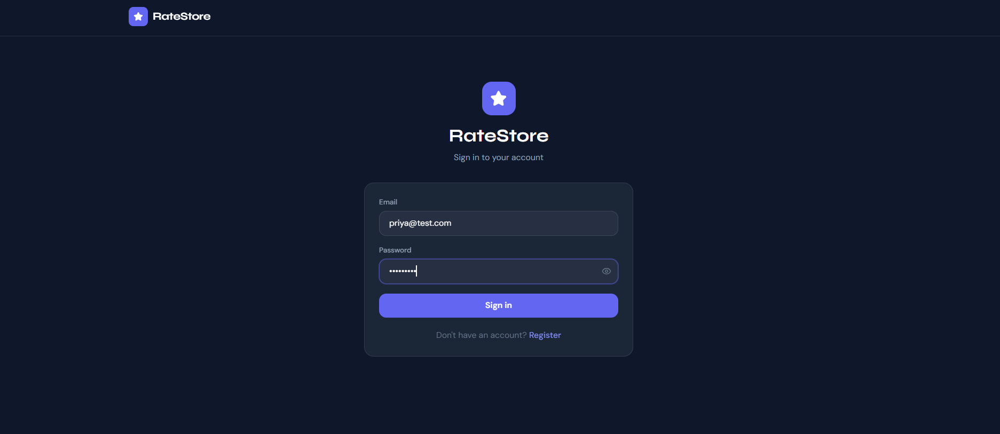
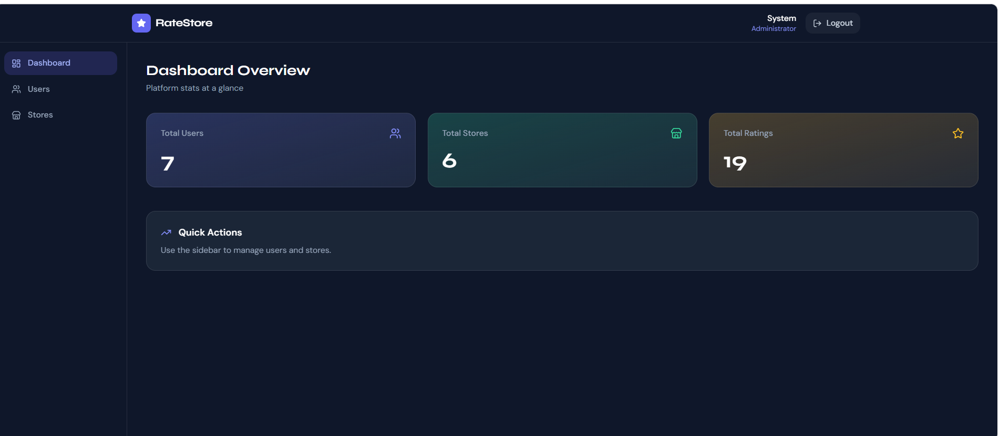
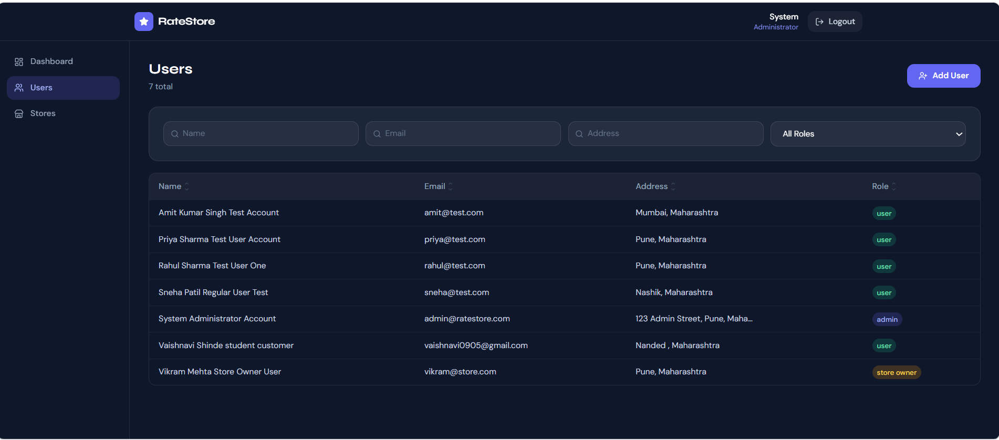
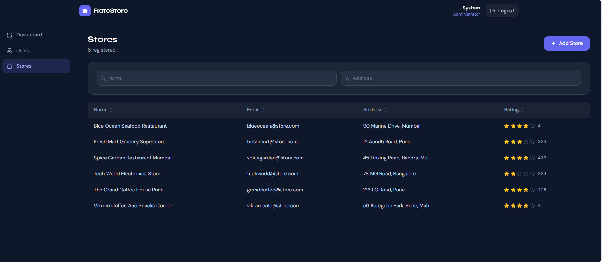
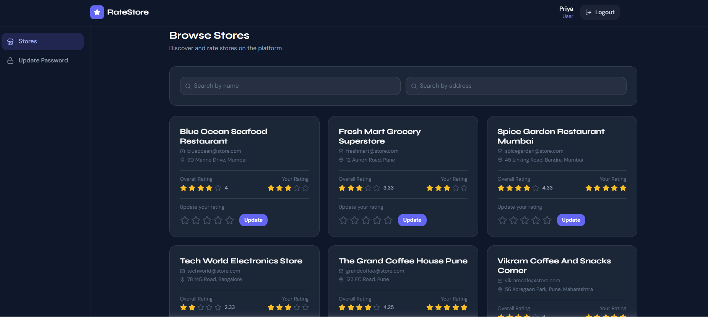
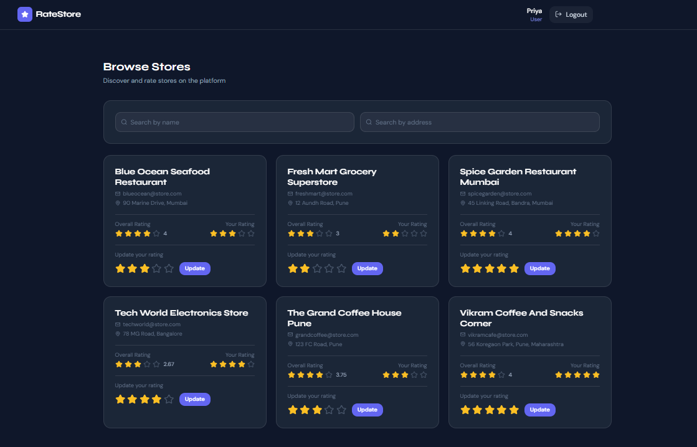
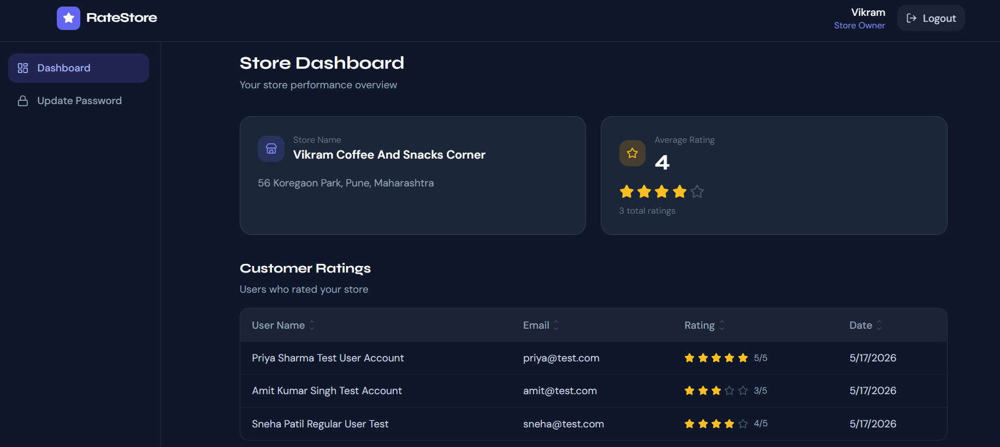

# 🌟 Store Rating Platform

A full-stack web application built for the **Roxiler Systems Full Stack Intern Assignment**. Users can rate registered stores, with role-based access for Admins, Normal Users, and Store Owners.

---

## 🖼️ Screenshots

### Login Page


### Admin Dashboard


### Admin – Users List


### Admin – Stores List


### User – Browse & Rate Stores


### User – Store Ratings View


### Store Owner Dashboard


---

## 🛠️ Tech Stack

| Layer | Technology |
|---|---|
| Frontend | React.js, Tailwind CSS, React Router v6, Axios |
| Backend | NestJS (Node.js) |
| Database | PostgreSQL + TypeORM |
| Auth | JWT (JSON Web Tokens) + Passport.js |
| Password Hashing | bcrypt |

---

## 👥 User Roles & Features

### 🔴 System Administrator
- Dashboard with total users, stores, and ratings count
- Add normal users, admins, and store owners
- View + filter all users (by Name, Email, Address, Role)
- View + search all stores with their average ratings
- View individual user details (Store Owners show their store's avg rating)
- Sortable tables (ascending/descending)
- Logout

### 🟢 Normal User
- Register & login
- Browse all stores with search by Name/Address
- See overall store rating and their own submitted rating
- Submit a rating (1–5 stars) per store
- Modify an existing rating
- Update password
- Logout

### 🟡 Store Owner
- Login
- Dashboard showing all users who rated their store
- Average rating of their store displayed with stars
- Update password
- Logout

---

## ✅ Form Validations

| Field | Rule |
|---|---|
| Name | Min 20 characters, Max 60 characters |
| Address | Max 400 characters |
| Password | 8–16 chars, must include at least one uppercase letter and one special character |
| Email | Standard email format |
| Rating | Integer between 1 and 5 |

---

## 📁 Project Structure

```
store-rating-platform/
├── backend/                  # NestJS API
│   ├── src/
│   │   ├── auth/             # JWT auth, guards, strategies
│   │   ├── users/            # User CRUD + admin dashboard
│   │   ├── stores/           # Store management + owner dashboard
│   │   ├── ratings/          # Submit & update ratings
│   │   └── app.module.ts
│   ├── seed-admin.js         # Script to create first admin
│   └── .env
├── frontend/                 # React SPA
│   └── src/
│       ├── api/              # Axios instance
│       ├── context/          # Auth context
│       ├── components/       # Navbar, StarRating, SortableTable, ProtectedRoute
│       └── pages/
│           ├── admin/        # Dashboard, Users, Stores
│           ├── user/         # Stores, UpdatePassword
│           └── owner/        # Dashboard, UpdatePassword
└── screenshots/              # App screenshots
```

---

## 🚀 Setup & Installation

### Prerequisites
- Node.js >= 18
- PostgreSQL running locally

### 1. Clone the repository
```bash
git clone https://github.com/YOUR_USERNAME/store-rating-platform.git
cd store-rating-platform
```

### 2. Database Setup
```sql
CREATE DATABASE store_rating_db;
```

### 3. Backend Setup
```bash
cd backend
npm install
```

Create `.env` in the `backend/` folder:
```env
DB_HOST=localhost
DB_PORT=5432
DB_USERNAME=postgres
DB_PASSWORD=your_password
DB_NAME=store_rating_db
JWT_SECRET=super_secret_jwt_key_roxiler_2026
JWT_EXPIRY=7d
```

```bash
npm run start:dev
```
Backend runs on: `http://localhost:3000/api`

### 4. Seed First Admin
```bash
node seed-admin.js
```
- **Email:** `admin@ratestore.com`
- **Password:** `Admin@1234`

### 5. Frontend Setup
```bash
cd ../frontend
npm install
```
Windows PowerShell:
```powershell
$env:PORT=3001; npm start
```
Mac/Linux:
```bash
PORT=3001 npm start
```
Frontend runs on: `http://localhost:3001`

---

## 🔌 API Endpoints

### Auth
| Method | Endpoint | Access |
|---|---|---|
| POST | `/api/auth/register` | Public |
| POST | `/api/auth/login` | Public |
| PUT | `/api/auth/update-password` | Authenticated |

### Users (Admin only)
| Method | Endpoint | Description |
|---|---|---|
| GET | `/api/users` | List users with filters |
| POST | `/api/users` | Create user |
| GET | `/api/users/dashboard` | Platform stats |
| GET | `/api/users/:id` | User detail |

### Stores
| Method | Endpoint | Access |
|---|---|---|
| GET | `/api/stores` | Authenticated |
| POST | `/api/stores` | Admin only |
| GET | `/api/stores/owner-dashboard` | Store Owner |

### Ratings
| Method | Endpoint | Access |
|---|---|---|
| POST | `/api/ratings` | Normal User |
| PUT | `/api/ratings/:id` | Normal User |

---

## 🗄️ Database Schema

```
users       → id, name, email, password, address, role, createdAt
stores      → id, name, email, address, ownerId (FK → users), createdAt
ratings     → id, value(1-5), userId (FK), storeId (FK), createdAt, updatedAt
              UNIQUE(userId, storeId)
```

---

## 🧪 Test Accounts

| Role | Email | Password |
|---|---|---|
| Admin | admin@ratestore.com | Admin@1234 |
| Normal User | rahul@test.com | Test@1234 |
| Normal User | priya@test.com | Test@1234 |
| Store Owner | vikram@store.com | Owner@1234 |

---

*Vaishnavi Shinde*